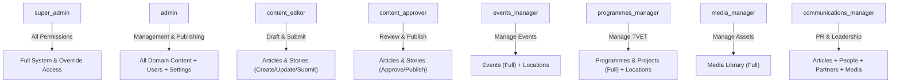

# Role-Based Access Control (RBAC) & Governance Architecture

This document defines the authorization and governance model for the **Genius Hub Digital Platform**.

---

## 1. Architectural Philosophy

1. **Least Privilege**: Staff members are granted only the permissions necessary to fulfill their specific organizational function.
2. **Server-Side Enforcement**: The frontend and admin panel UI are never considered security boundaries. All operations through Payload Local API, REST, and GraphQL are strictly authorized server-side.
3. **Multi-Role Capability**: Staff members may hold multiple responsibilities simultaneously (e.g. `[content_editor, events_manager]`), with permissions aggregating union-style.
4. **Founder Super Admin Principle**: The founder (**Isimeme Whyte**) is assigned the `super_admin` role through data configuration rather than hardcoded logic. Super Administrator privileges provide administrative management and emergency publishing overrides while remaining fully subject to immutable audit logging.
5. **Strict Identity Separation**: The `users` collection is dedicated exclusively to internal staff. Public beneficiaries, students, donors, and applicants will use a dedicated identity schema in future phases.

---

## 2. Staff Roles Dictionary

| Role Identifier          | Role Title             | Description & Scope                                                                                                                   |
| :----------------------- | :--------------------- | :------------------------------------------------------------------------------------------------------------------------------------ |
| `super_admin`            | Super Administrator    | Highest organizational authority (Founder/CEO). Full access across all collections, staff account governance, and approval overrides. |
| `admin`                  | Administrator          | Senior operations manager. Manages staff accounts, organizational settings, and cross-departmental publishing.                        |
| `content_editor`         | Content Editor         | Editorial contributor. Creates and edits articles, success stories, and media for review.                                             |
| `content_approver`       | Content Approver       | Lead editor / reviewer. Reviews, approves, and publishes submitted articles, stories, and taxonomies.                                 |
| `events_manager`         | Events Manager         | Events coordinator. Manages summits, workshops, exhibitions, schedules, and event locations.                                          |
| `programmes_manager`     | Programmes Manager     | TVET & capacity building lead. Manages training curricula, projects, and partner alignment.                                           |
| `media_manager`          | Media Manager          | Digital asset archivist. Manages global photography and video archives.                                                               |
| `applications_manager`   | Applications Manager   | Admissions officer. Reviews and processes training applications and beneficiary registrations.                                        |
| `commerce_manager`       | Commerce Manager       | Enterprise & studio lead. Manages products and studio service bookings.                                                               |
| `communications_manager` | Communications Manager | PR & Public Affairs lead. Manages leadership profiles, press releases, partner disclosures, and branding.                             |

---

## 3. Namespaced Permissions Matrix

| Domain / Scope      | Permission Namespace                                                                            | Description                                      |
| :------------------ | :---------------------------------------------------------------------------------------------- | :----------------------------------------------- |
| **Articles**        | `articles.read`, `create`, `update`, `submit`, `approve`, `publish`, `archive`, `delete`        | Editorial news and thought leadership lifecycle. |
| **Events**          | `events.read`, `create`, `update`, `submit`, `approve`, `publish`, `archive`, `delete`          | Summits, workshops, and webinar schedules.       |
| **Programmes**      | `programmes.read`, `create`, `update`, `submit`, `approve`, `publish`, `archive`, `delete`      | TVET and vocational curricula tracks.            |
| **Projects**        | `projects.read`, `create`, `update`, `submit`, `approve`, `publish`, `archive`, `delete`        | Concrete grant-funded initiatives.               |
| **Success Stories** | `success_stories.read`, `create`, `update`, `submit`, `approve`, `publish`, `archive`, `delete` | Beneficiary impact narratives.                   |
| **Media**           | `media.read`, `create`, `update`, `delete`                                                      | Image, video, and PDF asset archives.            |
| **People**          | `people.read`, `create`, `update`, `publish`, `delete`                                          | Leadership and staff directory profiles.         |
| **Partners**        | `partners.read`, `create`, `update`, `publish`, `delete`                                        | Institutional partner relationships.             |
| **Locations**       | `locations.read`, `create`, `update`, `delete`                                                  | Physical hubs, training centers, and venues.     |
| **Focus Areas**     | `focus_areas.read`, `create`, `update`, `delete`                                                | Strategic topical SEO pillars.                   |
| **Taxonomies**      | `taxonomies.read`, `create`, `update`, `delete`                                                 | Article categories and topic tags.               |
| **Staff Identity**  | `users.read`, `create`, `invite`, `update_roles`, `suspend`, `disable`, `delete`                | Staff lifecycle and administrative governance.   |
| **Invitations**     | `invitations.read`, `create`, `revoke`, `resend`                                                | Cryptographic onboarding tokens.                 |
| **Audit Logs**      | `audit.read`                                                                                    | Immutable administrative audit log access.       |
| **Settings**        | `settings.read`, `settings.update`                                                              | Global brand configuration.                      |

---

## 4. Role $\rightarrow$ Permission Mapping



---

## 5. Evaluation & Access Control Helpers

All permission checks resolve through pure, type-safe functions located in `src/lib/access/`:

```typescript
import { hasPermission, hasRole, isSuperAdmin } from '@/lib/access';

// Evaluate if the active user possesses permission
if (hasPermission(req.user, 'articles.publish')) {
  // Allow publication
}

// Evaluate role membership
if (hasRole(req.user, 'admin')) {
  // Allow administrative operation
}
```
