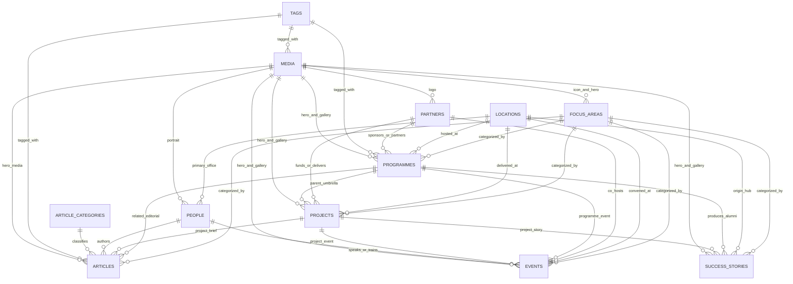

# Genius Hub — Domain Content Model & Schema Architecture

## 1. Overview & Organizational Context

The Genius Hub digital platform operates as a global development organization originating from Nigeria. The content architecture accurately reflects the organization's real operations across vocational training, tech innovation, enterprise incubation, partner ecosystems, human storytelling, and multi-hub delivery.

---

## 2. Entity-Relationship Topology

The diagram below illustrates the authoritative relationship directions across Genius Hub's content domains:

---

## 3. Authoritative vs Derived Relationship Strategy

To prevent data drift, circular write conflicts, and manual dual-entry synchronization errors:

1. **Single Authoritative Source**: Relationships are stored on the **referencing entity** (e.g., `Programme.focusAreas`, `Programme.locations`, `Project.parentProgramme`, `Article.authors`, `Event.venueLocation`).
2. **Derived Inverse Queries**: Reverse relationships (e.g., "All projects under Programme X" or "All stories from Focus Area Y") are resolved dynamically at query time using the Payload Local API (`where: { parentProgramme: { equals: programmeId } }`).
3. **Relational Join Tables**: Under PostgreSQL, `@payloadcms/db-postgres` persists multi-relations in dedicated relational join tables (`programmes_rels`, `projects_rels`, `events_rels`, `articles_rels`).

---

## 4. Collection Dictionary

### A. Focus Areas (`focus-areas`)

- **Purpose**: Strategic developmental pillars (e.g., Digital Skills, Vocational/TVET, Enterprise Incubation, Migration Reintegration, Women Empowerment).
- **Key Fields**: `title` (localized), `slug`, `description` (localized), `icon` (Media), `heroMedia` (Media), `displayOrder`, `isFeatured`, `seo`.
- **Public / Indexable**: **Yes** (`/focus-areas/[slug]`). Strategically vital for topical authority and SEO.

### B. Locations (`locations`)

- **Purpose**: Physical training hubs, innovation centers, regional offices, and event facilities.
- **Key Fields**: `name` (localized), `slug`, `locationType`, `address` (optional street text, localized), `city` (localized), `stateOrRegion` (localized), `country` (localized), `coordinates` (latitude, longitude), `flags` (`isOffice`, `isProgrammeLocation`, `isEventVenue`), `contactInfo`, `openingHours`, `mapDisplay`, `isPublicPageEnabled`, `seo`.
- **Public / Indexable**: Optional (`isPublicPageEnabled`). Hub directory views render on `/locations`.

### C. Programmes (`programmes`)

- **Purpose**: Long-running organizational training umbrellas, cohort curriculums, and capacity interventions.
- **Key Fields**: `title` (localized), `slug`, `shortDescription` (localized), `fullDescription` (Lexical rich text, localized), `focusAreas` (Rel to FocusAreas), `targetAudience` (localized), `deliveryFormat`, `locations` (Rel to Locations), `schedule` (`startDate`, `endDate`, `isOngoing`), `applicationStatus`, `applicationUrl`, `heroMedia`, `gallery`, `partners`, `tags`, `impactStatistics`, `isFeatured`, `status`, `seo`.
- **Public / Indexable**: **Yes** (`/programmes/[slug]`). Primary conversion funnel (`Apply for training`).

### D. Projects (`projects`)

- **Purpose**: Specific funded interventions, donor-supported delivery efforts, and campaigns.
- **Key Fields**: `title` (localized), `slug`, `summary` (localized), `fullContent` (Lexical rich text, localized), `parentProgramme` (Rel to Programmes), `focusAreas`, `partners`, `locations`, `timeline`, `projectStatus`, `beneficiaryMetrics`, `fundingAndSupport`, `outcomes` (localized), `reportsAndDocuments` (Media), `heroMedia`, `gallery`, `tags`, `isFeatured`, `seo`.
- **Public / Indexable**: **Yes** (`/projects/[slug]`). Essential for partner disclosures and institutional transparency.

### E. Events (`events`)

- **Purpose**: Interactive workshops, summits, hackathons, masterclasses, and ceremonies.
- **Key Fields**: `title` (localized), `slug`, `description` (Lexical rich text, localized), `eventType`, `format`, `schedule` (`startDateTime`, `endDateTime`, `timezone`), `venueLocation` (Rel to Locations), `customVenueNotes` (localized), `onlineAccess` (`meetingUrl`, `accessInstructions`), `focusAreas`, `speakers` (Rel to People), `partners`, `tags`, `relatedProgramme`, `relatedProject`, `heroMedia`, `gallery`, `status`, `seo`.
- **Public / Indexable**: **Yes** (`/events/[slug]`).

### F. People (`people`)

- **Purpose**: Directory of leadership (including Founder Isimeme Whyte), staff, instructors, facilitators, speakers, and authors.
- **Key Fields**: `fullName`, `slug`, `role` (localized), `organization` (localized), `division` (localized), `profileImage` (Media), `shortBio` (localized), `fullBio` (Lexical rich text, localized), `primaryLocation` (Rel to Locations), `designations` (`isLeadership`, `isBoardMember`, `isTeamMember`, `isFacilitator`, `isSpeaker`, `isAuthor`), `socialLinks`, `contactInfo` (with visibility toggles), `displayOrder`, `status`, `seo`.
- **Public / Indexable**: **Yes** (`/people/[slug]`).

### G. Partners (`partners`)

- **Purpose**: Institutional partners, bilateral donors, government agencies, corporate alliances, and NGOs.
- **Key Fields**: `name`, `slug`, `logo` (Media, required), `website`, `partnerType`, `relationshipType`, `description` (localized), `timeline` (`startYear`, `endYear`), `isFeatured`, `seo`.
- **Public / Indexable**: **Yes** (`/partners/[slug]`). Primary conversion funnel (`Partner with Genius Hub`).

### H. Success Stories (`success-stories`)

- **Purpose**: Beneficiary impact narratives, alumni journeys, and pull-quote testimonials.
- **Key Fields**: `title` (localized), `slug`, `beneficiaryName`, `beneficiaryRole` (localized), `location` (Rel to Locations), `focusAreas`, `relatedProgramme`, `relatedProject`, `quote` (localized), `summary` (localized), `fullStory` (Lexical rich text, localized), `impactMetrics` (localized), `tags`, `heroMedia`, `gallery`, `isFeatured`, `status`, `seo`.
- **Public / Indexable**: **Yes** (`/stories/[slug]`).

### I. Articles (`articles`)

- **Purpose**: Editorial publications, industry insights, policy analysis, corporate announcements, and dispatches.
- **Key Fields**: `title` (localized), `slug`, `excerpt` (localized), `content` (Lexical rich text, localized), `category` (Rel to ArticleCategories), `focusAreas`, `tags`, `authors` (Rel to People), `publishedAt`, `heroMedia`, `relatedProgrammes`, `relatedProjects`, `relatedEvents`, `status`, `seo`.
- **Public / Indexable**: **Yes** (`/insights/[slug]`).

### J. Article Categories (`article-categories`)

- **Purpose**: Controlled editorial categorization taxonomy.
- **Key Fields**: `name` (localized), `slug`, `description` (localized), `displayOrder`, `seo`.
- **Public / Indexable**: **Yes** (`/insights/category/[slug]`).

### K. Tags (`tags`)

- **Purpose**: Lightweight cross-cutting topic tagging.
- **Key Fields**: `name` (localized), `slug`.
- **Public / Indexable**: Queryable across listings.

### L. Media (`media`)

- **Purpose**: Centralized asset library with upload capabilities, automated variant sizing (`thumbnail`, `card`, `hero`), alt text, and attribution.
- **Key Fields**: `alt` (localized), `title` (localized), `caption` (localized), `mediaType`, `attribution` (`photographerOrSource`, `copyrightNotes`), `location`, `dateCaptured`, `tags` (Rel to Tags), `externalVideoUrl`.
- **Public / Indexable**: Assets served via static/CDN endpoints.

### M. Users (`users`)

- **Purpose**: Authentication collection for Payload Admin Panel.
- **Scope in Phase 02**: Minimal authentication (`name`, `email`, `password`). Advanced multi-role RBAC, invitations, approval authorities, and MFA are deferred to Phase 03.

### N. Site Settings (`site-settings` Global)

- **Purpose**: Institutional brand identity, HQ contact channels, official social handles, and global fallback SEO.

---

## 5. Localization Decisions

| Aspect                   | Decision                                                           | Rationale                                                                     |
| :----------------------- | :----------------------------------------------------------------- | :---------------------------------------------------------------------------- |
| **Locales**              | `en` (default), `fr`, `de`                                         | Enables international reach; extensible to future African languages.          |
| **Fallback**             | `fallback: true`                                                   | Missing translations safely fall back to English without throwing errors.     |
| **Localized Fields**     | Titles, summaries, descriptions, rich text, bios, quotes, SEO text | Editorial content consumed by readers in their native languages.              |
| **Non-Localized Fields** | Slugs, IDs, coordinates, dates, flags, relationships, URLs         | Preserves routing stability, relational integrity, and technical consistency. |
