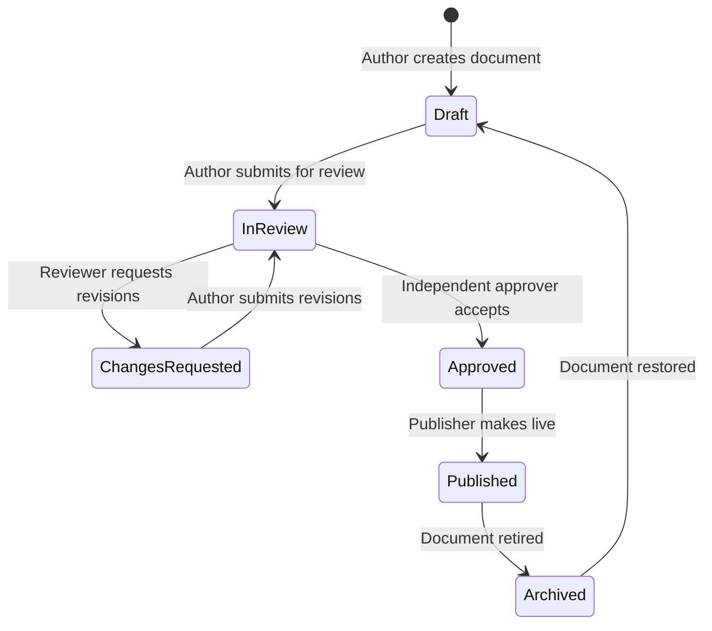

# Editorial Content Workflow & Review Governance

This document describes the publication lifecycle and review workflow for public-facing Genius Hub collections (`Articles`, `Events`, `Programmes`, `Projects`, `SuccessStories`).

---

## 1. Workflow Lifecycle States

| State                 | Status Identifier   | Description                                               | Required Action / Permission |
| :-------------------- | :------------------ | :-------------------------------------------------------- | :--------------------------- |
| **Draft**             | `draft`             | Work in progress; not visible to public visitors.         | `*.create` or `*.update`     |
| **In Review**         | `in_review`         | Submitted to editorial board for review and verification. | `*.submit`                   |
| **Changes Requested** | `changes_requested` | Reviewer left editorial feedback in `reviewNotes`.        | `*.update`                   |
| **Approved**          | `approved`          | Formally approved by an authorized reviewer.              | `*.approve`                  |
| **Published**         | `published`         | Live on public website and indexable by search engines.   | `*.publish`                  |
| **Archived**          | `archived`          | Historical record retired from primary public listings.   | `*.archive`                  |

---

## 2. Separation of Duties Policy

To ensure high journalistic and organizational standards, the platform enforces separation of duties:

1. **No Self-Approval**: A content author who submitted an item for review (`submittedBy`) **cannot** approve their own submission (`approvedBy`).
2. **Independent Review Requirement**: Content approval must be performed by a distinct staff member holding the appropriate `*.approve` permission (e.g., `content_approver` or `admin`).
3. **Super Admin Override**: The `super_admin` role possesses an emergency override to approve and publish self-authored urgent announcements or crisis communications.

---

## 3. Workflow Attribution Metadata

Every workflow document tracks the following audit metadata:

- `workflow.submittedAt`: Timestamp when the document was submitted for review.
- `workflow.submittedBy`: Staff author who submitted the document.
- `workflow.approvedAt`: Timestamp of formal editorial approval.
- `workflow.approvedBy`: Independent staff reviewer who approved the document.
- `workflow.publishedAt`: Timestamp of public deployment.
- `workflow.publishedBy`: Staff member who published the document.
- `workflow.reviewNotes`: Editorial feedback, revision comments, or internal verification notes.
