# Genius Hub Information Architecture (IA) Specification

## 1. Executive Summary

Genius Hub is a global development organization originating from Benin City, Edo State, Nigeria. Its primary mission is youth and women empowerment through vocational education (TVET), digital innovation, creative enterprise incubation, and economic stabilization.

This document establishes the public content taxonomy, URL hierarchy, routing model, and global navigation relationships designed to serve our three core stakeholder groups:

1. **Programme Beneficiaries & Applicants**: Youth, women, artisans, and tech trainees seeking practical training cohorts and business starter toolkits.
2. **Institutional Donors & Partners**: Multilateral development agencies, government ministries, corporate CSR leaders, and foundations requiring evidence, M&E reports, and governance disclosures.
3. **Clients, Consumers & Community**: Patrons of ethical artisan crafts (Shop), creative studio services, events, and public stories.

---

## 2. Complete Public Sitemap & Route Structure

```mermaid
graph TD
  Root["/ (Home)"] --> About["/about (About Genius Hub)"]
  Root --> WhatWeDo["/focus-areas (What We Do)"]
  Root --> Impact["/impact (Evidence & Results)"]
  Root --> Events["/events (Events & Workshops)"]
  Root --> Stories["/stories (Stories & Insights)"]
  Root --> Shop["/shop (Social Enterprise Shop)"]
  Root --> Opportunities["/opportunities (Opportunities & Careers)"]
  Root --> CTAs["Direct Action Routes"]
  Root --> Legal["Legal & Trust Routes"]

  About --> AboutLeadership["/about/leadership"]
  About --> AboutStory["/about/our-story"]
  About --> AboutGov["/about/governance"]
  About --> AboutLoc["/about/locations"]
  About --> AboutPartners["/about/partners"]

  WhatWeDo --> FocusAreasSlug["/focus-areas/[slug]"]
  WhatWeDo --> Programmes["/programmes"]
  Programmes --> ProgrammesSlug["/programmes/[slug]"]
  WhatWeDo --> Projects["/projects"]
  Projects --> ProjectsSlug["/projects/[slug]"]

  Impact --> ImpactStories["/impact/success-stories"]
  ImpactStories --> ImpactStorySlug["/impact/success-stories/[slug]"]
  Impact --> ImpactReports["/impact/reports"]
  Impact --> ImpactReach["/impact/geographic-reach"]

  Events --> EventsSlug["/events/[slug]"]
  Stories --> StoriesSlug["/stories/[slug]"]
  Shop --> ShopSlug["/shop/[slug]"]

  CTAs --> Apply["/apply (Primary Admission CTA)"]
  CTAs --> Partner["/partner (Institutional Partner CTA)"]
  CTAs --> Donate["/donate (Support / Seed Toolkits)"]
  CTAs --> Contact["/contact (General & Campus Desk)"]

  Legal --> Privacy["/privacy"]
  Legal --> Terms["/terms"]
  Legal --> Accessibility["/accessibility"]
```

---

## 3. Route Inventory & SEO Metadata Matrix

| Route                            | Content Type        | Primary Purpose                                                    | Priority | Change Frequency |
| -------------------------------- | ------------------- | ------------------------------------------------------------------ | -------- | ---------------- |
| `/`                              | Landing Shell       | Core mission, hero narrative, impact metrics, ecosystem navigation | 1.0      | Daily            |
| `/about`                         | Static Index        | Organization purpose, methodology, and history                     | 0.9      | Monthly          |
| `/about/leadership`              | Profile Directory   | Founder Isimeme Whyte, executive team, advisory council            | 0.8      | Monthly          |
| `/about/our-story`               | Narrative           | Heritage from Benin City to international expansion                | 0.8      | Monthly          |
| `/about/governance`              | Trust & Compliance  | Fiduciary standards, audit transparency, safeguarding              | 0.8      | Monthly          |
| `/about/locations`               | Facility Directory  | Benin City Innovation Campus, Lagos Studio, field units            | 0.8      | Monthly          |
| `/about/partners`                | Ecosystem Directory | Multilateral donors, government agencies, corporate CSR            | 0.8      | Monthly          |
| `/focus-areas`                   | Pillar Directory    | 6 strategic thematic development pillars                           | 0.9      | Weekly           |
| `/focus-areas/[slug]`            | Pillar Detail       | Deep-dive per thematic development pillar                          | 0.8      | Weekly           |
| `/programmes`                    | Catalog             | Ongoing training tracks (vocational, tech, enterprise)             | 0.9      | Weekly           |
| `/programmes/[slug]`             | Dynamic Shell       | Programme curriculum, cohort dates, entry criteria                 | 0.8      | Weekly           |
| `/projects`                      | Project Portfolio   | Donor-backed field interventions and active milestones             | 0.9      | Weekly           |
| `/projects/[slug]`               | Dynamic Shell       | Milestones, M&E targets, partner collaboration                     | 0.8      | Weekly           |
| `/impact`                        | Impact Hub          | Cumulative beneficiary stats, M&E metrics overview                 | 0.9      | Weekly           |
| `/impact/success-stories`        | Case Study Index    | Beneficiary transformations and alumni enterprise spotlights       | 0.8      | Weekly           |
| `/impact/success-stories/[slug]` | Story Detail        | Qualitative testimony, before/after journey, metrics               | 0.8      | Weekly           |
| `/impact/reports`                | Publications        | Audited annual reports, evaluation briefs, policy papers           | 0.8      | Monthly          |
| `/impact/geographic-reach`       | Regional Overview   | Footprint across South-South, South-West, North-Central            | 0.7      | Monthly          |
| `/events`                        | Event Calendar      | Upcoming conferences, masterclasses, and runway exhibitions        | 0.8      | Daily            |
| `/events/[slug]`                 | Event Detail        | Event agenda, speaker lineup, venue & virtual access               | 0.8      | Daily            |
| `/stories`                       | Blog / Editorial    | Thought leadership, field dispatches, development analysis         | 0.8      | Daily            |
| `/stories/[slug]`                | Article Detail      | Editorial article with metadata, author, and reading time          | 0.8      | Daily            |
| `/shop`                          | Social Enterprise   | Ethical artisan goods, handmade apparel, and crafts                | 0.8      | Weekly           |
| `/shop/[slug]`                   | Product Detail      | Artisan provenance, materials, social reinvestment notice          | 0.8      | Weekly           |
| `/opportunities`                 | Opportunities Hub   | Open cohort admissions, job vacancies, fellowships                 | 0.8      | Weekly           |
| `/apply`                         | Admission CTA       | Clear 3-step application path for prospective trainees             | 0.9      | Weekly           |
| `/partner`                       | Partner CTA         | Structured collaboration tracks for donors and industry            | 0.9      | Monthly          |
| `/donate`                        | Support CTA         | Transparent sponsorship tiers for student starter toolkits         | 0.8      | Monthly          |
| `/contact`                       | Contact & Inquiries | Campus contact information, departmental contact routing           | 0.8      | Monthly          |
| `/privacy`                       | Legal / Trust       | NDPA 2023 and global privacy compliance disclosure                 | 0.5      | Yearly           |
| `/terms`                         | Legal / Trust       | Digital platform terms of use and IP guidelines                    | 0.5      | Yearly           |
| `/accessibility`                 | Accessibility       | WCAG 2.2 AA conformance pledge and audit measures                  | 0.5      | Yearly           |

---

## 4. CTA Priority & Decision Hierarchy

To maintain clarity and prevent cognitive overload, navigation surfaces adhere to a strict visual hierarchy:

1. **Dominant Header CTA**: **"Apply for Training"** (`/apply`)
   - Distinct high-contrast orange button (`#FF6B00`) in desktop header and mobile drawer.
   - Represents the primary programmatic engine of Genius Hub.
2. **Secondary High-Value CTAs**: **"Partner With Us"** (`/partner`) & **"Donate"** (`/donate`)
   - Surfaced prominently inside desktop Mega Menus, mobile navigation drawer footer, and site footer.
   - Prevents competing visual buttons in the top navbar while ensuring zero-click discovery.
3. **Contextual Action CTAs**:
   - Programme pages -> Link to `/apply`
   - Project pages -> Link to `/partner`
   - Story / Report pages -> Link to `/contact` / `/donate`
