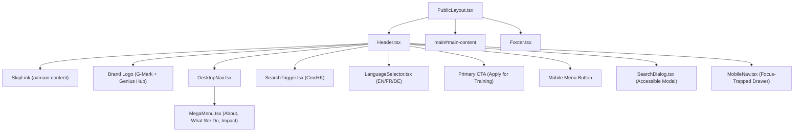

# Global Navigation & Header System

## 1. Architectural Overview

The Genius Hub navigation system is designed for high accessibility, responsiveness, and clean separation between public web interfaces and the Payload CMS admin panel (`/admin`).

All navigation items, mega-menu structures, direct action CTAs, and footer columns are statically and strongly typed in:

```typescript
src / config / navigation.ts;
```

---

## 2. Component Composition



---

## 3. Key Navigation Features

### 3.1 Desktop Mega Menu (`MegaMenu.tsx`)

- **Hover & Keyboard Focus Active**: Renders cleanly on mouse hover or explicit keyboard focus.
- **Categorized Multi-Column Layout**: Organizes links by thematic functional areas with subtitles and badges (`New`, `Popular`, `Impact`).
- **Featured Initiative Promo Card**: Dedicated promotional banner inside the mega menu (e.g. _Youth TVET Cohort 2026_, _West Africa Creative Summit_).

### 3.2 Mobile Slide-Out Drawer (`MobileNav.tsx`)

- **Responsive Breakpoint**: Activates below `lg` breakpoint (`< 1024px`).
- **Interactive Accordions**: Allows deep navigation into About, What We Do, and Impact without visual clutter.
- **Focus Containment & Escape Dismissal**: Automatically traps keyboard focus within the dialog, locks background scrolling (`body { overflow: hidden }`), and closes seamlessly on `Escape` or backdrop touch.
- **Full Action Suite**: Direct access to Apply, Partner, and Donate buttons at the base of the drawer.

### 3.3 Global Search System (`SearchDialog.tsx`)

- **Modal Trigger**: Accessible `SearchTrigger` button in desktop and mobile header with `Cmd+K` / `Ctrl+K` global keyboard shortcut.
- **Content-Type Filter Pills**: Allows filtering by `All`, `Programmes`, `Projects`, `Stories`, `Events`, and `Store`.
- **Live Search Filtering**: Instant client-side index filtering across titles, categories, and descriptions with keyboard arrow selection.

### 3.4 Multi-Language Foundation (`LanguageSelector.tsx`)

- **Accessible Popover**: Fully accessible language dropdown supporting English (default), Français, and Deutsch.
- **Visual State**: Displays native language names and highlights active selection with a checkmark.

### 3.5 Global Page Header & Breadcrumbs (`PageHeader.tsx`)

- **Consistent Page Intro Primitive**: Standardizes display typography (`Outfit`), eyebrow category badges, lead summaries, and semantic breadcrumb navigation across all subpages.
- **Structured Data Compatibility**: Breadcrumb trail renders semantic `<nav aria-label="Breadcrumb">` and `<ol>` markup compatible with schema.org JSON-LD BreadcrumbList.
