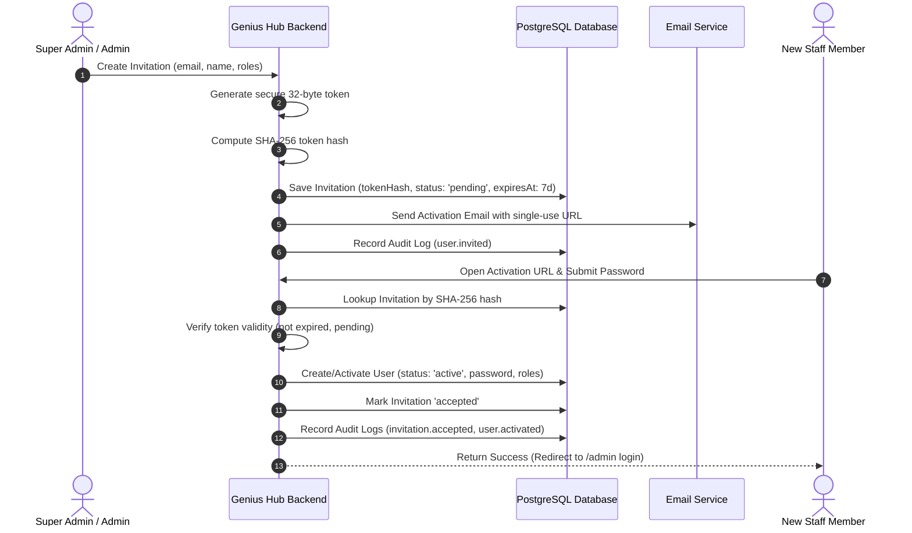

# Staff Authentication, Lifecycle & Invitation System

This guide outlines the authentication architecture, cryptographic invitation lifecycle, and account management for Genius Hub staff members.

---

## 1. Staff Identity Model

Staff accounts are managed in the `users` collection within Payload CMS:

- **Authentication**: Managed natively by Payload using robust cryptographic password hashing (Argon2 / bcrypt / scrypt).
- **Required Identity**: Valid email address and full name.
- **Account Statuses**:
  - `invited`: Initial state when an onboarding invitation is dispatched.
  - `active`: Operational account capable of authenticating and executing permitted actions.
  - `suspended`: Temporarily blocked account (cannot log in; retains audit attribution).
  - `disabled`: Permanently deactivated account (cannot log in; retains audit attribution).

> [!IMPORTANT]
> Staff records are **never hard-deleted** when access is revoked. Inactive accounts are marked `disabled` or `suspended` to maintain historical attribution across audit trails and editorial authorship.

---

## 2. Cryptographic Invitation Workflow

Staff onboarding follows a zero-trust, cryptographic token workflow:

### Security Properties:

1. **No Plaintext Token Persistence**: Only the SHA-256 hash of the 32-byte token is stored in the database.
2. **Single-Use Enforcement**: Upon successful password creation, the invitation status changes to `accepted` and cannot be reused.
3. **Time-Limited Expiration**: Invitations expire 7 days after issuance by default.
4. **Revocability**: Administrators can revoke pending invitations at any time before acceptance.
5. **No Password Transmission**: Passwords are never sent via email or generated as reusable defaults.

---

## 3. Account Lifecycle Management

Administrators with `users.suspend` or `users.disable` permissions can manage account states:

- **Suspension**: Setting `status: 'suspended'` immediately blocks authentication across the Payload Admin Panel and APIs.
- **Reactivation**: Setting `status: 'active'` restores account privileges.
- **Role Reassignment**: Setting `roles` requires `users.update_roles` or `super_admin`. Every status or role mutation is recorded in `AuditLogs` with before/after state snapshots.

---

## 4. Multi-Factor Authentication (MFA) & Session Security

- **MFA Readiness**: A readiness field `mfaEnabled` is incorporated into the `users` schema in preparation for production TOTP enforcement.
- **Brute-Force Protection**: Configured with `maxLoginAttempts: 5` and a 10-minute lockout window.
- **Session Cookies**: In production, Payload session cookies are configured with `httpOnly`, `sameSite: 'lax'`, and `secure: true`.
